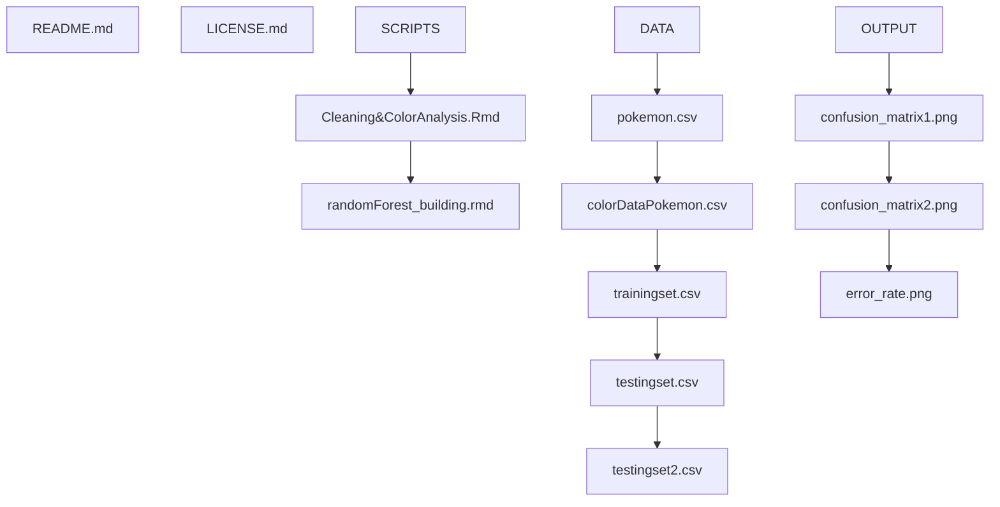

# DS4002-Project3 

## Contents of Repository
This repository contains the code and documentation for investigating whether it is possible to predict the primary types of different Pokemon based on the hex color codes found in their graphic images. This repository contains a README file, LICENSE file, SCRIPTS folder, DATA folder, and OUTPUT folder. 

## Section 1: Software and Platform Section
- Software Used: RStudio (R)
- Packages Used: tidyverse, randomForest, hues, colorfindr
- Platform used: Mac

## Section 2: Map of Documentation 

- Outline or tree of hierarchy of folders and subfolders and list the files stored in each folder

## Section 3: Instructions for Reproducing Results

GET THE DATA:
1. Download the "pokemon" csv and "images" folder from Kaggle onto your computer
2. Download the "pokemon-images-dataset-by-type" images and folders from GitHub onto your computer
3. Read in the csv and save as a data frame in R
4. Read in each folder of images and save as lists in R

CLEAN THE DATA:
1. Convert the Type1 and Type2 columns into factors
2. Create a file list of images for each type folder
3. In a for loop, get the top 3 most used colors for each Pokemon image in the list
4. Create a data frame containing these hex values, and filter for the 7 most used colors across all images for each type
5. Generate a swatch/palette for each type
6. Combine all palettes into one data frame and save as "colorDataPokemon.csv"
7. Create training and testing sets using same method as above, this time choosing the top 7 colors for each Pokemon.
8. Combine training set with Type1 from pokemon.csv
9. Save these dataframes as "trainingset.csv" and "testingset.csv"

CREATE EXPLORATORY PLOTS FOR EDA:
1. Use ggplot to create different bar plots that will help to visualize our data, where the Pokemon type is on the x-axis and the frequency of respective Pokemon types are on  the y-axis for each graph
2. Create sample color palettes and plots for specific Pokemon to see what the hex codes represent (and to display the different hues of color)
3. Save these plots into the OUTPUT folder

DATA PREP FOR RANDOM FORESTS MODEL BUILDING:
1. Read in trainingset.csv, testingset.csv, and testingset2.csv files
2. Clean all three data sets so that all character values appear as lowercase
3. For all three data sets, rename the "Type1" column as "primary_type"
4. Combine the testingset.csv data frame with the testingset2.csv data frame using the merge() function by "name" (this is the Pokemon name column)
5. Combine the data frame created in step 4 with the data frame from trainingset.csv using the rbind() function
6. Reshape the total combined data frame from step 5 using the pivot_longer() function so that the hex values appear in columns

CONVERT HEX CODES TO THEIR RESPECTIVE R, G, B NUMERIC VALUES

1. Use the sapply() function in combination with the col2rgb() function to expand each hex code into its respective R, G, B numeric values
2. Save the respective R, G, B numeric values into the data frame as columns 
3. Remove the hex code column from the data frame 

CREATE THE RANDOM FORESTS MODEL
1. Create a 70% training 30% testing split using our data set
2. Use the randomForest package to train the random forest model on our training data
3. Use the predict() function and the random forest model we created in step 2 on our testing data to test the accuracy of our model
