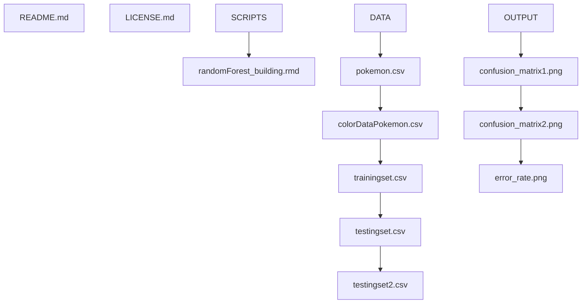

# DS4002-Project3 

## Contents of Repository
This repository contains the code and documentation for investigating whether it is possible to predict the primary types of different Pokemon based on the hex color codes found in their graphic images. This repository contains a README file, LICENSE file, SCRIPTS folder, DATA folder, and OUTPUT folder. 

## Section 1: Software and Platform Section
- Software Used: RStudio (R)
- Packages Used: tidyverse, randomForest
- Platform used: Mac

## Section 2: Map of Documentation 

- Outline or tree of hierarchy of folders and subfolders and list the files stored in each folder

## Section 3: Instructions for Reproducing Results

GET THE DATA:
1. AVERYYYYYY 

CLEAN THE DATA:
1. AVERYYYYYY

CREATE EXPLORATORY PLOTS FOR EDA:
1. Use ggplot to create different bar plots that will help to visualize our data, where the Pokemon type is on the x-axis and the frequency of respective Pokemon types are on  the y-axis for each graph
2. Create sample color palettes and plots for specific Pokemon to see what the hex codes represent (and to display the different hues of color)
3. Save these plots into the OUTPUT folder

DATA PREP FOR RANDOM FORESTS MODEL BUILDING:
1. Read in trainingset.csv, testingset.csv, and testingset2.csv files
2. Clean all three data sets so that all character values appear as lowercase
3. For all three data sets, rename the "Type1" column as "primary_type"
4. Combine the testingset.csv data frame with the testingset2.csv data frame using the merge() function by "name" (this is the Pokemon name column)
5. Combine the data frame created in step 4 with the data frame from trainingset.csv using the the rbind() function
6. Reshape the total combined data frame from step 5 using the pivot_longer() function so that the hex values appear in columns
   
BASIC CLASSIFICATION TREE -- RECURSIVE BINARY SPLITTING:

1. Use the tree::tree(...,data=...) function from the tree library in R to create the first basic classification tree model
2. Apply summary() to the classification tree created above
   - This will give you the significant variables used, the number of terminal nodes, the residual mean deviance, and also the misclassification error rate of the model (test error rate!)
3. Apply plot() and text() to the classification tree created in (1) to view the graphical output
4. Optional: Use the y response of our data set, the y response of our test data set, the tree we created in (1), the predict() function, and the table() function in R to create a confusion matrix

CLASSIFICATION TREE USING RPART PACKAGE IN R:
1. Use the rpart() and rpart.plot() functions from the rpart and rpart.plot packages in R to create classification trees that are more informative and visually appealing than the basic models we created above
   - The rpart() method can be used on our data set to actually create the classification tree, while the rpart.plot() method is used to output the classification tree graphically

PRUNE THE CLASSIFICATION TREE:
1. You may need to use the tree::cv.tree() and tree::prune.misclass() functions on our initial basic classification tree model to remove some of the branches, reduce its complexity, or improve its general performance-- pruning a classification tree generally prevents overfitting of the data in the model
   - Note that in our project, when we pruned the classification tree using our data set and then reapplied the plot() function on our tree to observe its graphical output, our tree looked exactly the same as before pruning-- in this specific case it appears that pruning the classification tree will not lead to significant improvements

ANSWER THE RESEARCH QUESTION AND DETERMINE FUTURE PROJECT IMPROVEMENT:
1. Since our original research question asked whether we could create a model to successfully determine the sex of unisex-named babies (under the hypothesis that we would have more female than male babies), the last step of this investigation would be to look at the test error rate of our model to determine its success, and also the ending branches of the model to determine whether our hypothesis is supported by the model we created
2. Ask: are there any underlying trends in the classification model we created that we did not anticipate, but can help to lead us into further investigation?
3. With time allowing, after pruning our classification tree we would want to use explore methods that could potentially create more accurate models, such as bagging, random forests, and boosting

